# Docker

## 1. Docker Install

1. Installer Docker et Docker-Compose sur Ubuntu (https://docs.docker.com/get-docker/ &
   https://docs.docker.com/compose/install/)

2. Quelques commandes à tester
   - docker run hello-world
   Hello-world d’exemple avec Docker
   - docker run -it ubuntu bash
   Création d’un conteneur et utilisation d’un bash en interactif
   exit ou Ctrl+D - Pour sortir du conteneur
   - docker images
   Afficher les images Docker disponibles en local
   - docker ps -a
   Affiche tous les conteneurs (en exécution ou pas, grâce à l’option -a)
   - docker run -p 80:80 nginx et docker run -p -d 80:80 nginx
   Démarre un serveur web disponible sur votre navigateur à l’adresse
   localhost:80

3. Ressources supplémentaires pour découvrir Docker
   - https://docs.docker.com/get-started/02_our_app/
   - Et les autres articles du “Getting Started” Docker

## 2. Docker TP

4. Début du TP
   Initialiser un nouveau repository git qui vous permettra de sauvegarder les fichiers
   créés pendant le TP. Vous enverrez un zip du repository à la fin du TP avec vos
   réponses aux questions / exécutions et résultats sur la console dans des fichiers
   texte (Markdown par exemple) par e-mail.
   Utilisez git progressivement ! (Ne pas faire qu’un seul commit à la fin)
   
 - [Github Repo](https://github.com/x33lyS/DevOps/tree/DockerTP1)

5. Exécuter un serveur web (apache, nginx, …) dans un conteneur docker
   a. Récupérer l’image sur le Docker Hub
   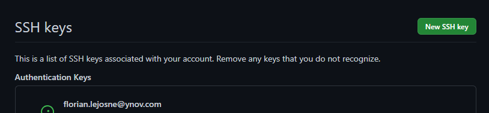

   b. Vérifier que cette image est présente en local
   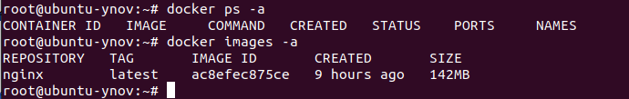

   c. Créer un fichier index.html simple : [index.html](webSite/index.html)

   d. Démarrer un conteneur et servir la page html créée précédemment à l’aide
   d’un volume (option -v de docker run)
   
   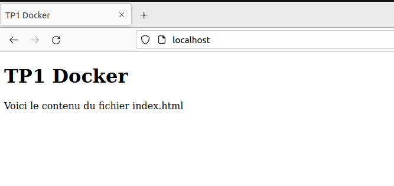

   e. Supprimer le conteneur précédent et arriver au même résultat que
   précédemment à l’aide de la commande docker cp

   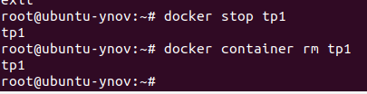
   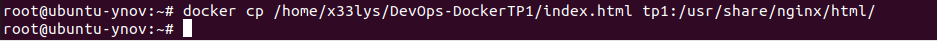

6. Builder une image
   - a. A l’aide d’un Dockerfile, créer une image (commande docker build)
   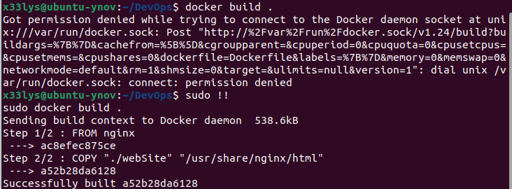
   - b. Exécuter cette nouvelle image de manière à servir la page html (commande
   docker run)
   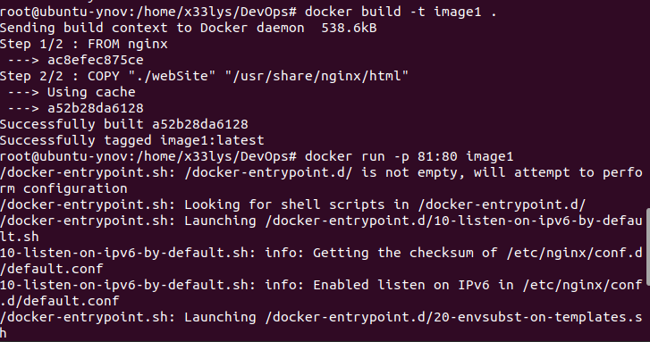
   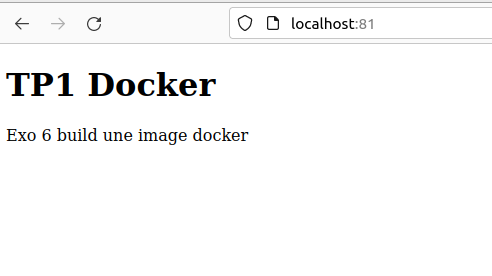
   - c. Quelles différences observez-vous entre les procédures 5. et 6. ? Avantages
   et inconvénients de l’une et de l’autre méthode ? (Mettre en relation ce qui est
   observé avec ce qui a été présenté pendant le cours)

7. Utiliser une base de données dans un conteneur docker
   - a. Récupérer les images mysql et phpmyadmin/phpmyadmin depuis le
   Docker Hub
   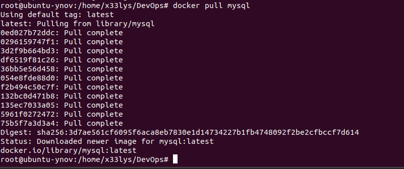
   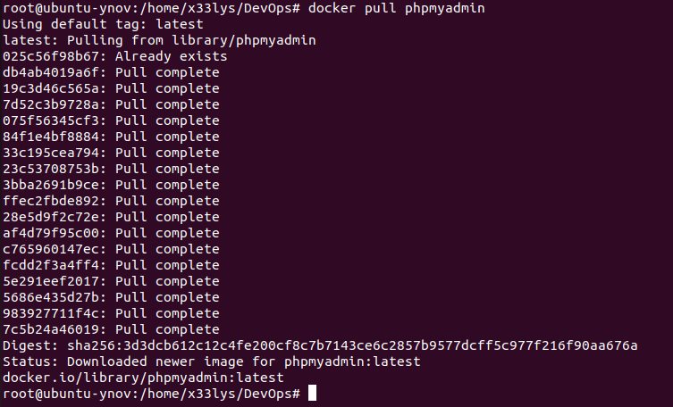
   - b. Exécuter deux conteneurs à partir des images et ajouter une table ainsi que
   quelques enregistrements dans la base de données à l’aide de phpmyadmin
    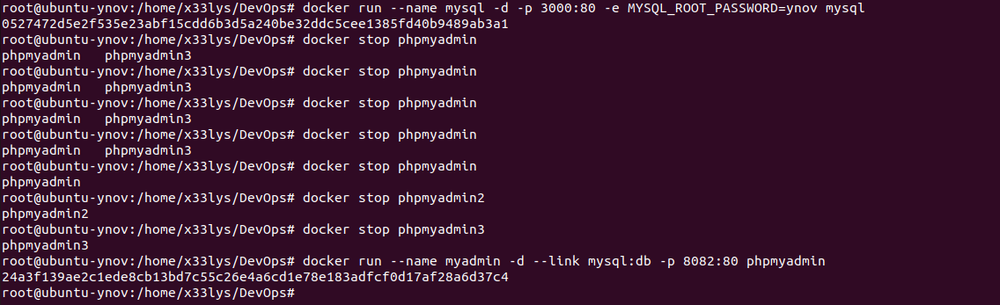
    
    
    cette commande sert à lier le server mysql avec la base de donnée de phpmyadmin
    
    

8. Faire la même chose que précédemment en utilisant un fichier
   docker-compose.yml
   
   

   - a. Qu’apporte le fichier docker-compose par rapport aux commandes docker run
   ? Pourquoi est-il intéressant ? (cf. ce qui a été présenté pendant le cours)
      
Beaucoup plus rapide et une fois le fichier est configurer il suffit de faire docker compose up pours que le tout se mette en route.

  - b. Quel moyen permet de configurer (premier utilisateur, première base de
  données, mot de passe root, …) facilement le conteneur mysql au lancement ?
9. Observation de l’isolation réseau entre 3 conteneurs
    - a. A l’aide de docker-compose et de l’image praqma/network-multitool
    disponible sur le Docker Hub créer 3 services (web, app et db) et 2 réseaux
    (frontend et backend).
    Les services web et db ne devront pas pouvoir effectuer de ping de l’un vers
    l’autre
    - b. Quelles lignes du résultat de la commande docker inspect justifient ce
    comportement ?
    - c. Dans quelle situation réelles (avec quelles images) pourrait-on avoir cette
    configuration réseau ? Dans quel but ?
