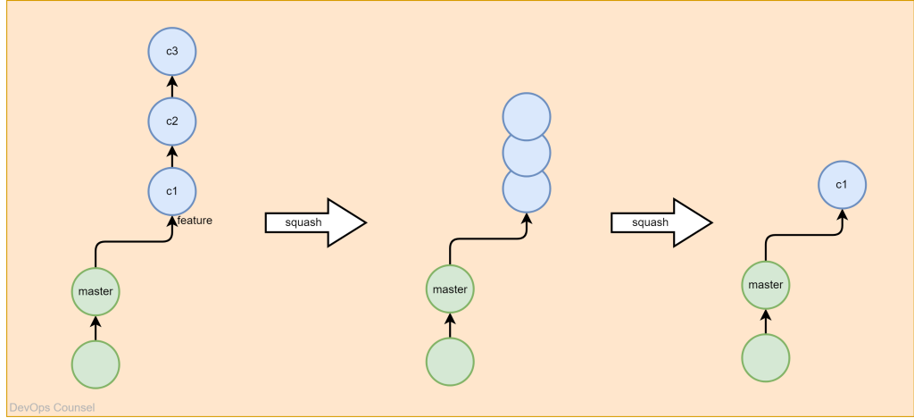
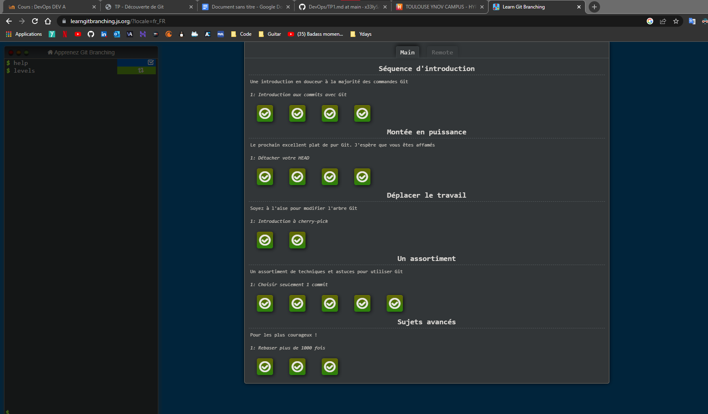

# TP1
## Partie 1 - Tutoriel guidé

### Les nouvelles commandes GIT

J’ai découvert lors de ce cours la commande **git squash** qui fusionne plusieurs commits en un seul gros commit.

## Partie 2 - Mise en pratique

**Niveaux bonus :**

## Author

- Lejosne Florian

